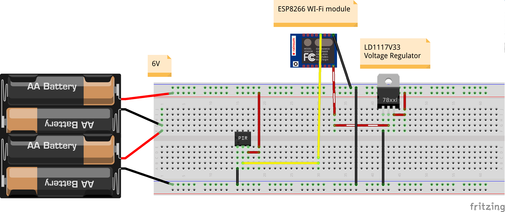

# Home Alarm

The home alarm system based on PIR sensor.

## Sensor Block

The plan is to have a PIR sensor conneceted to WIFI module and packaged together with batteries in one box.

  

## TODO:
* order parts
* test parts
* code sensor
* descripe monitor block
* monitor block schema
* test parts
* code monitor
* create sensor block box
* place sensors
* profit!!